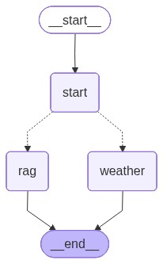
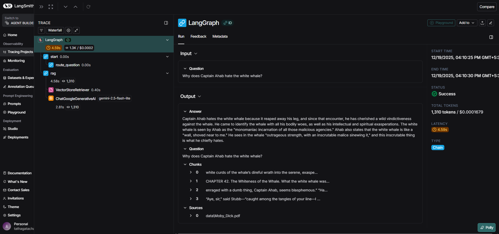
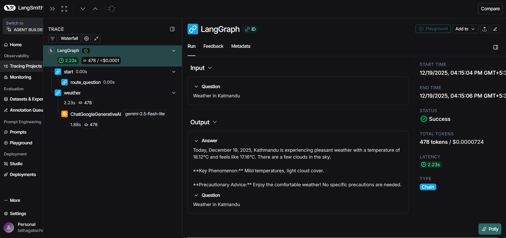

# 🧵 AgentWeave — Agentic AI with Tool Use & RAG

**AgentWeave** is a production-style **Agentic AI application** that intelligently routes user queries between **real-time tools** and a **Retrieval-Augmented Generation (RAG)** pipeline.  
It is built using **LangGraph**, **LangChain**, **Google Gemini**, and **Qdrant**, and demonstrates explainable, modular, and scalable GenAI system design.

> Weaving tools, knowledge, and reasoning into a single intelligent agent.

---

## 🔍 What This Project Demonstrates

This project showcases hands-on experience with:

- Agentic AI systems using **LangGraph**
- **Tool-aware LLM reasoning** (API + knowledge routing)
- **Retrieval-Augmented Generation (RAG)**
- **Vector databases (Qdrant)**
- **LLM embeddings & semantic search**
- **Explainable AI (showing retrieved context)**
- Clean architecture and modular Python code
- Interactive UI with **Streamlit**

---

## 🚀 Key Features

### 🤖 Agentic Orchestration (LangGraph)
- Conditional routing between multiple capabilities
- Deterministic decision-making using graph-based workflows
- Easily extensible with new tools or agents

### 🌦️ Real-Time Tool Integration
- Live weather data via **OpenWeather API**
- Structured API responses summarized using **Gemini LLM**

### 📚 Retrieval-Augmented Generation (RAG)
- PDF ingestion and chunking using `RecursiveCharacterTextSplitter`
- Semantic embeddings via **Gemini `text-embedding-004`**
- Vector search powered by **Qdrant**
- Top-K retrieval for grounded LLM responses

### 🔎 Explainability & Transparency
- Displays retrieved document chunks in the UI
- Shows source documents used to generate answers
- Reduces hallucinations by enforcing context grounding

### 🖥️ Interactive Streamlit UI
- Chat-based interface
- Expandable panels for retrieved chunks and sources
- Clean UX suitable for demos and interviews

---

## 🧠 Architecture Overview

```

User Query
↓
Streamlit UI
↓
LangGraph Agent
↓
Routing Logic
├── Tool Path → OpenWeather API → Gemini Summary
└── RAG Path → Qdrant Vector Search → Gemini Answer
↓
Answer + Retrieved Chunks + Sources

````

---

## 🛠️ Tech Stack & Skills

**Languages**
- Python

**LLMs & GenAI**
- Google Gemini (LLM)
- Gemini `text-embedding-004`
- Prompt engineering
- Hallucination mitigation via RAG

**Frameworks**
- LangGraph (agent orchestration)
- LangChain (RAG, embeddings, retrievers)

**Databases**
- Qdrant (vector database)

**UI**
- Streamlit

**DevOps / Tooling**
- Docker (Qdrant)
- REST APIs
- Environment-based configuration
- Modular, testable codebase

---

## 📄 Demo Knowledge Base

For demo purposes, AgentWeave uses an excerpt from **_Moby-Dick_** (public-domain literature) as the knowledge base.

Why this choice:
- No licensing or IP concerns
- Rich semantic content for RAG
- Clear, intuitive demo questions

> The same pipeline can be applied to **enterprise documents** such as policies, architecture docs, manuals, or reports without code changes.

---

## ✂️ Chunking Strategy (RAG Best Practice)

```python
RecursiveCharacterTextSplitter(
    chunk_size=1200,
    chunk_overlap=250,
)
````

This improves:

* Semantic coherence
* Retrieval accuracy
* LLM answer quality

---

## 🧪 Example Queries

### Tool-Based Query

```
What is the weather in Delhi?
```

### RAG-Based Queries

```
Who is Ishmael?
```

```
What is the Pequod?
```

```
Why does Captain Ahab hate the white whale?
```

### 📈 LangSmith Tracing & Evaluation

AgentWeave uses **LangSmith** to trace, debug, and evaluate the end-to-end agentic workflow, including routing decisions, tool usage, retrieval steps, and LLM responses.

LangSmith provides:

* Full visibility into **LangGraph execution**
* Inspection of **RAG retrieval context**
* Evaluation of **LLM inputs and outputs**
* Easier debugging and observability for agentic systems

#### 🔍 Tracked Components

* LangGraph routing decisions (Weather vs RAG)
* OpenWeather API tool invocation
* Qdrant vector retrieval
* Gemini LLM prompts and responses
* Safety guardrail enforcement

---

### 📸 LangSmith Trace Screenshots (Placeholders)

> The following screenshots illustrate LangSmith traces captured during execution.
> These will be replaced with actual screenshots during final submission.

#### 1️⃣ LangGraph Execution Trace

Shows the agent’s decision-making and routing logic.



---

#### 2️⃣ RAG Retrieval & Vector Search Trace

Shows Qdrant vector retrieval and retrieved document chunks.



---

#### 3️⃣ Weather Agent



---

### ✅ Why LangSmith Was Used

LangSmith enables:

* Observability for agentic workflows
* Evaluation of LLM behavior
* Verification of RAG grounding
* Debugging of multi-step reasoning pipelines

---

## ⚙️ Setup Instructions (Windows)

### 1️⃣ Clone Repository

```bash
git clone https://github.com/your-username/AgentWeave.git
cd AgentWeave
```

### 2️⃣ Create Virtual Environment

```powershell
python -m venv .venv
.venv\Scripts\activate
```

### 3️⃣ Install Dependencies

```powershell
pip install -r requirements.txt
```

### 4️⃣ Environment Variables

Create a `.env` file:

```env
GOOGLE_API_KEY=your_gemini_api_key
OPENWEATHER_API_KEY=your_openweather_api_key
```

### 5️⃣ Run Qdrant (Docker)

```bash
docker run -d ^
  -p 6431:6333 ^
  -p 6432:6334 ^
  qdrant/qdrant
```

### 6️⃣ Ingest the PDF

```powershell
python ingest.py
```

### 7️⃣ Run the App

```powershell
streamlit run app.py
```

---

## 🧪 Testing

Includes basic tests for:

* Agent routing logic
* RAG execution
* Tool invocation

```powershell
pytest
```

---

## 📈 LangSmith (Optional)

AgentWeave can be instrumented with **LangSmith** to:

* Trace agent decisions
* Evaluate LLM outputs
* Debug retrieval quality

Useful for:

* LLM observability
* Model evaluation
* Demo screenshots

---

## 🧩 Extensibility

AgentWeave is designed to scale:

* Add more tools (databases, ticketing systems, APIs)
* Introduce reranking or MMR retrieval
* Extend to multi-agent workflows
* Replace Streamlit with a production frontend

---

## 🎯 Why This Project Matters

AgentWeave demonstrates **real-world GenAI engineering**, including:

* Agentic design patterns
* Tool orchestration
* Explainable RAG
* Production-ready architecture

This project is suitable for:

* AI Engineer roles
* GenAI / LLM Engineer roles
* Full-Stack AI roles

---

## 📜 License

MIT License

```
